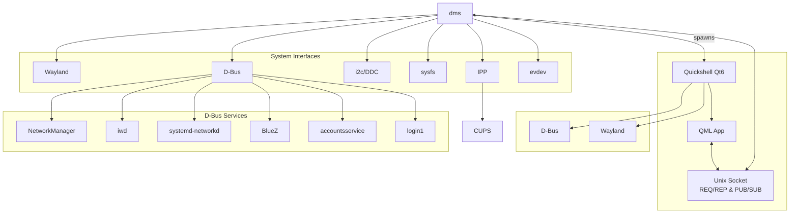

import Hero from '@site/src/components/Hero';

<Hero
  asciiArt={`██████╗ ███╗   ███╗███████╗
██╔══██╗████╗ ████║██╔════╝
██║  ██║██╔████╔██║███████╗
██║  ██║██║╚██╔╝██║╚════██║
██████╔╝██║ ╚═╝ ██║███████║
╚═════╝ ╚═╝     ╚═╝╚══════╝`}
  hideTitle={true}
/>

DankMaterialShell (dms) 是使用 [Quickshell](https://quickshell.org/) 和 [Go](https://go.dev/) 构建的 Wayland 桌面 shell。它的用途类似于 GNOME Shell 或 KDE Plasma，为启动应用程序、管理窗口、管理硬件接口、通知等提供统一的界面。

## 一般特点 {#general-features}

- 启动器（应用程序、文件搜索、网页搜索、表情符号搜索、计算以及可通过插件扩展）
- 系统托盘
- 支持分组的通知
- 网络管理（通过 NetworkManager、iwd、systemd-networkd 或某些混合设置）
- VPN 管理（通过 NetworkManager）
- 蓝牙管理（通过 BlueZ）
- 音频管理（通过 PipeWire）
- 空闲和电源管理
- 亮度控制（背光、LED 和 i2c/ddc）
- 锁屏
- 流程和系统监控
- 主题（浅色、深色、自动颜色、预制主题和自定义强调色）
- 多显示器支持
- 伽玛控制（夜间模式）
- 具有转换、多显示器支持和自动转换的壁纸管理。
- 剪贴板历史管理器
- 系统声音（如通知、音量变化等）
- 带音频可视化的 Mpris 媒体控件
- 使用默认浏览器选择进行 URL 处理的浏览器选择器模式
- 数十个小部件和插件可用于实现几乎任何您能想象到的功能。

*实在太多了，无法一一列举，但这些是一些亮点！*

## 架构 {#architecture}

DankMaterialShell 使用客户端-服务器架构，其中 Go 后端 (`dms`) 管理系统集成并生成基于 Quickshell 的 UI 作为子进程。通信使用 REQ/REP 和 PUB/SUB 模式通过 Unix 套接字进行。

<div style={{overflowX: 'auto', maxWidth: '100%'}}>



</div>

**要点：**

- **dms** 生成 **Quickshell** 作为子进程
- **dms** 和 **Quickshell** 均独立与 Wayland 和 D-Bus API 集成
- **dms** 填补了 Quickshell 本身无法处理的空白
- QML 应用程序和 dms 后端之间的通信通过 Unix 套接字进行

### 组件概述 {#component-overview}

|组件|角色 |
| --- | --- |
| **DankMaterialShell - Quickshell** |前端支持小部件、模式和用户体验。 |
| **DankMaterialShell - 后端 (cli)** |桥接 DBus、Wayland 和插件 API - 也是管理 CLI |
| **dgop** |资源小部件使用的可选系统遥测服务。 |
| **dsearch** | Spotlight 启动器使用的可选文件系统搜索引擎。 |

## 桌面集成 {#desktop-integration}

DankMaterialShell 包含一个浏览器选择器模式，当在 shell 中激活 URL 时会出现该模式。

### 打开 URL {#opening-urls}

您可以使用 `dms open` 命令直接从终端打开 URL：

```bash
dms open https://danklinux.com
```

打开 URL 时，DankMaterialShell 会显示一个模式对话框，其中包含已安装的 Web 浏览器列表，允许您选择首选浏览器或为将来打开的 URL 设置默认值。

### 设置默认 Web 浏览器 {#setting-default-web-browser}

要将 DankMaterialShell 设置为默认 Web 浏览器处理程序：

```bash
xdg-settings set default-web-browser dms-open.desktop
```

### 文件关联 {#file-associations}

您可以使用 `xdg-mime` 命令配置文件类型关联。例如，要将 DankMaterialShell 设置为特定 MIME 类型的默认处理程序：

```bash
# Set as default for HTTP/HTTPS URLs
xdg-mime default dms-open.desktop x-scheme-handler/http
xdg-mime default dms-open.desktop x-scheme-handler/https
```

### 桌面入口 {#desktop-entry}

桌面条目文件 (`dms-open.desktop`) 遵循 [freedesktop.org 桌面条目规范](https://specifications.freedesktop.org/desktop-entry-spec/desktop-entry-spec-latest.html)，并允许从应用程序菜单启动 DankMaterialShell 并与桌面环境集成。

## 后续步骤 {#next-steps}

继续[安装](./installation.mdx)，让 DankMaterialShell 在您的系统上运行。

DankMaterialShell 是开源的，欢迎做出各种贡献，从核心代码更改到新的小部件和插件，再到文档改进。
